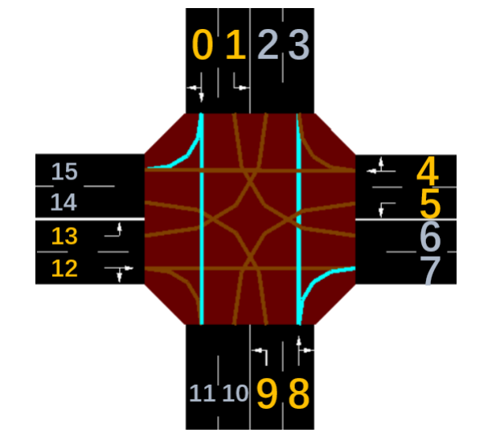

# Sumo note
@wily

## Construction
``` bash
|
|___net.xml(Road network construction, creation of traffic lights)
|___rou.xml(Create traffic information)
|___sumocfg(Combine net.xml and rou.xml)
```
## Several Questions
-  net.xml can be imported through external，such as[OSM](https://www.openstreetmap.org/)，netedit，artificial defination and so on  
```
$ netconvert --osm-files map.osm -o ***.net.xml
```  
- What is Phase？
```
Phase determines on each route whether passing through vehicles or not.
In reinforcement learning, it refers to the action.
```


- What is Car-following model?(什么是跟驰模型)
```
In sumo, we use modefied Krauss model, which is a kind of safe distance model, 
due to sumo website say: 'It is purely microscopic: each vehicle is modelled explicitly, 
has an own route, and moves individually through the network.'
```
For more details, [***look this***](https://zhuanlan.zhihu.com/p/364208270)


